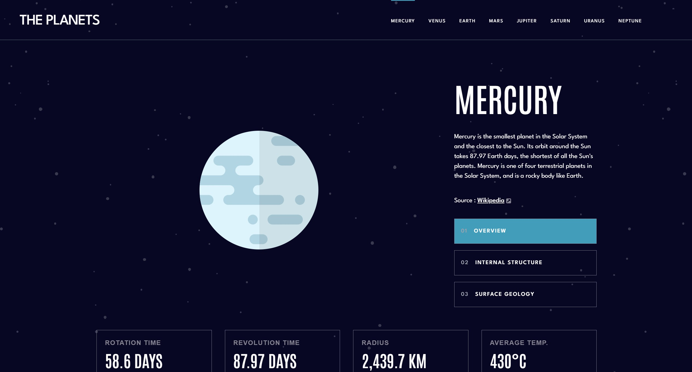

# Frontend Mentor - Planets fact site solution

This is a solution to the [Planets fact site challenge on Frontend Mentor](https://www.frontendmentor.io/challenges/planets-fact-site-gazqN8w_f). Frontend Mentor challenges help you improve your coding skills by building realistic projects. 

## Table of contents

- [Overview](#overview)
  - [The challenge](#the-challenge)
  - [Screenshot](#screenshot)
  - [Links](#links)
- [My process](#my-process)
  - [Built with](#built-with)
  - [Continued development](#continued-development)
- [Author](#author)
- [Acknowledgments](#acknowledgments)

## Overview

### The challenge

Users should be able to:

- View the optimal layout for the app depending on their device's screen size
- See hover states for all interactive elements on the page
- View each planet page and toggle between "Overview", "Internal Structure", and "Surface Geology"

### Screenshot

### Links

- Solution URL: [FrontEnd Mentor Solution](https://www.frontendmentor.io/solutions/mobile-first-page-using-react-tailwind-css-and-framer-motion-k8dVvtQbXa)
- Live Site URL: [Planets Facts site](https://planetfact-fm.netlify.app)

## My process

### Built with

- Semantic HTML5 markup
- CSS custom properties
- Flexbox
- CSS Grid
- Mobile-first workflow
- [React](https://reactjs.org/) - JS library
- [Framer Motion](https://www.framer.com/motion/)
- [Tailwind CSS](https://tailwindcss.com/)

### Continued development

- I will continue to improve the animations of the site. Some of the animations aren't as smooth.

## Author

- Website - [Mtendere Kulemeka Whayo](https://www.devmk.netlify.app)
- Frontend Mentor - [@yourusername](https://www.frontendmentor.io/profile/mkulemeka)
- Twitter - [@kahle01](https://www.twitter.com/kahle01)

## Acknowledgments

- Planet Fact site - [Tediko](https://planets-tediko.netlify.app)
